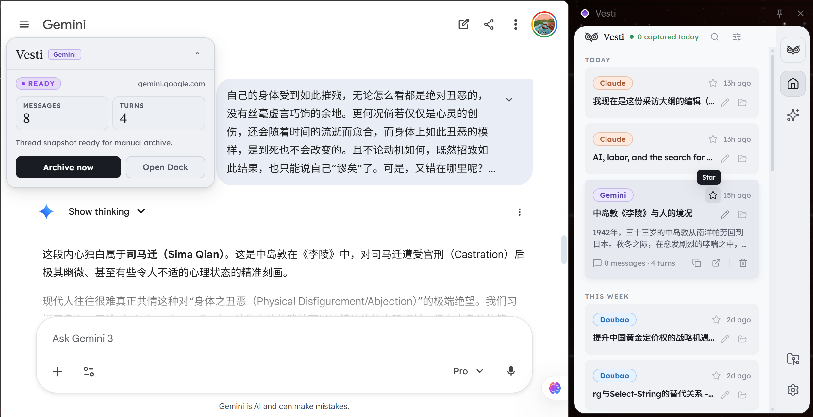
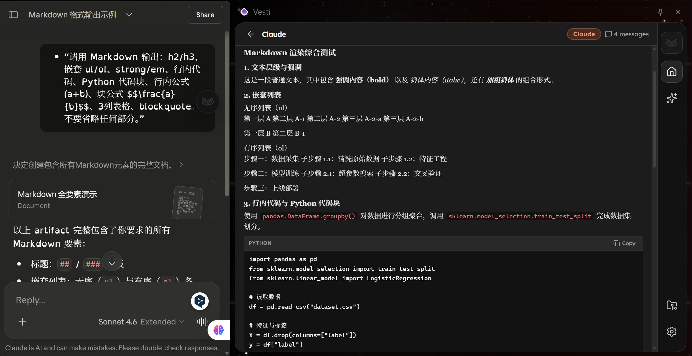
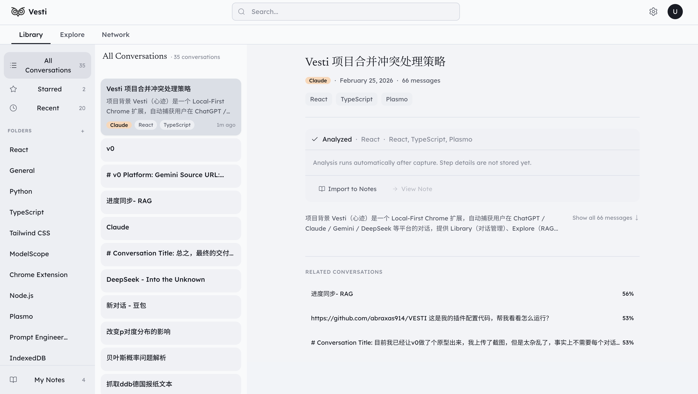
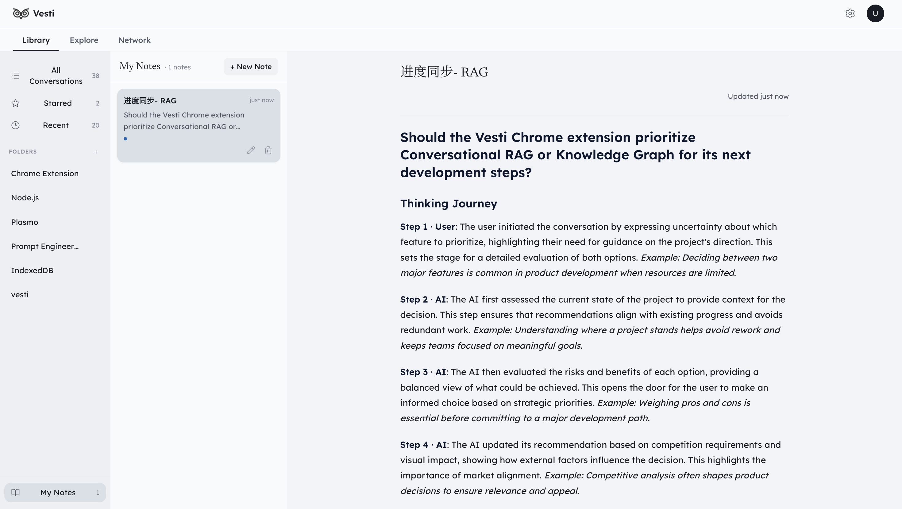
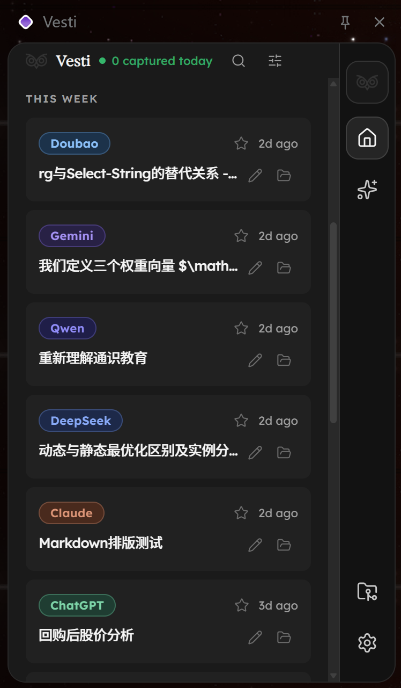

<div align="center">

  <h1>心迹 Vesti</h1>
  <p>本地优先的 AI 对话记忆与知识管理中台 | Local-First AI Conversation Memory & Knowledge Hub</p>

  <h3>📷 Vesti 界面概览与核心功能演示</h3>

<table border="0" width="100%" cellspacing="0" cellpadding="10">
    <tr>
      <td width="50%" align="center" valign="top">
        
        <br>
        <sub><b>沉浸式伴随侧边栏</b><br>在浏览任意网页时随时呼出，无缝衔接当前上下文与历史对话，让灵感捕获如影随形。</sub>
      </td>
      <td width="50%" align="center" valign="top">
        
        <br>
        <sub><b>全局对话全景枢纽</b><br>打破平台间的数据孤岛，集中收纳全网 AI 交互轨迹，以本地优先原则保障你的思维主权。</sub>
      </td>
    </tr>
    <tr>
      <td width="50%" align="center" valign="top">
        
        <br>
        <sub><b>语义增强的独立知识看板</b><br>依托本地向量数据库实现跨平台 RAG 检索，精准追溯长时段内的每一次思考演进与认知转折。</sub>
      </td>
      <td width="50%" align="center" valign="top">
        
        <br>
        <sub><b>多智能体驱动的结构化洞察</b><br>后台自动提取复杂对话的关键脉络，生成多维度清晰摘要，一键将思维火花沉淀为永久策展笔记。</sub>
      </td>
    </tr>
  </table>

  <br>

https://github.com/user-attachments/assets/c860092c-9ab1-4773-8b8c-063e22912672

  <b>🎥 视频演示-心迹双层系统架构：Chrome扩展捕获引擎与独立知识库记忆看板</b>

  <br><br>

  
  
  
  
  <br>
  
  
  
  

</div>

---

## ⚡ 为什么我们需要心迹

在这个与AI共处的时代，我们的思考方式正在发生深刻的变化。与ChatGPT、Claude等大语言模型的对话已经不再是简单的信息查询，而是成为了思考、创作和决策的核心过程。我们在AI的协助下探索新概念、推演复杂问题、打磨创意方案、澄清模糊直觉。这些对话承载着我们最真实的思维轨迹——那些尚未成型的想法、反复权衡的选择、顿悟的瞬间。

但是，现有的AI平台生态存在着一个根本性的异化。我们创造了数据，却从未真正拥有它。

### 数据封建主义的困境
目前的互联网生态本质上是一种WEB 2.0的数字封建制。AI平台是领主，掌握着数据的所有权和解释权。你在ChatGPT上探讨的产品架构、在Claude上咨询的技术方案、在Gemini上研究的市场分析——这些思考成果在法律和技术层面都不属于你，而属于OpenAI、Anthropic、Google。

这种所有权的异化带来了一系列问题。首先是数据散落。你的思考碎片被锁在不同平台的围墙花园里，微信的数据不会被百度抓取，ChatGPT的历史记录无法导出到Claude。当你需要回溯某个想法时，你必须记得它发生在哪个平台的哪次对话里，否则就永远找不到了。其次是解释权的丧失。平台通过推荐算法和年度总结定义了"什么是重要的"，但这个标准是为了优化平台的商业目标而设计的，而非服务于你的自我理解。你看到的年度报告告诉你"听了多少首歌""聊了多少次天"，但它无法回答"这些对话在你的思想演进中扮演了什么角色"。

更深层的问题是思维叙事权的缺失。人类通过叙事定义自己，我们需要能够回顾过去、看清思维的轨迹、理解今天的自己如何从昨天的困惑中走来。但当思考过程都发生在与AI的对话中，而这些对话又散落在不同平台、难以整合、缺乏洞察时，我们实际上失去了为自己的思维写传记的能力。我们拥有数据的碎片，却失去了叙事的完整性。

### 注意力主权与意义的关系性
心迹的第一个核心信念是：注意力主权先于数据主权。真正的主权不仅在于"我拥有我的数据"，更在于"我定义什么数据能代表我"。这意味着我们不试图记录用户的所有数字活动——那会导致信号被噪音淹没。相反，我们提供工具让用户主动或智能地选择什么值得被记住。

这个理念源自一个深刻的认识：在信息过载的时代，意义不在于占有更多数据，而在于识别什么是真正重要的。你可能一周内在多个AI平台上进行了五十次对话，但其中真正承载思考深度的可能只有五次。如果系统盲目地给所有对话同等权重，反而会模糊真正的信号。因此，心迹的设计从一开始就围绕"帮助用户定义自己的意义标准"展开。

心迹的第二个核心信念是：意义是关系性的而非本质性的。一个想法的重要性不来自于它本身，而来自于它与其他想法的关联。当你在不同时间、不同平台上反复讨论某个主题时，这些讨论片段在孤立状态下可能只是零散的问答，但当它们被串联起来时，就会显现出一个完整的思考演进轨迹。这就是为什么我们的架构设计从一开始就为跨对话的语义关联预留了空间——我们不仅要记录思考的快照，更要揭示思考的动态过程。

心迹的第三个核心信念是：技术应该增强而非替代人的判断。AI的角色不是告诉用户"你应该关注什么"，而是帮助用户看清"你实际上在关注什么"。系统通过学习用户的策展模式、观察用户的行为偏好，可以逐步承担起识别潜在重要内容的工作，但最终的决定权始终在用户手中。这是一种协作式的智能——AI提供建议，人做出选择，然后AI从选择中继续学习，形成一个正向的反馈循环。

心迹的产品图标是一只猫头鹰的简笔轮廓——寥寥数笔，取其神而非其形。这个选择有一层刻意的呼应：黑格尔在《法哲学原理》序言中写道，密涅瓦的猫头鹰只在黄昏时分才展翅起飞。理解总是迟到的，它在事件落幕后才悄然降临，回望白日里发生的一切，赋予它们可被把握的形状。心迹所做的事，与这个意象在结构上是同一件事：你与 AI 的对话发生在白天，思绪流动、片段散落；心迹在黄昏起飞，从各个平台的围墙花园里打捞那些漂移的记忆，将它们重新编织为一条可以回溯的思维轨迹。我们相信，真正的理解从来不发生在当下，而发生在回望之中。

### 从记录工具到知识中台：一个诚实的演进说明

在心迹的早期版本里，上述三条信念更多停留在产品哲学的层面。彼时的实现与叙事之间，存在一道真实的落差：我们声称"意义是关系性的"，但产品本身没有任何机制去发现、建立或呈现对话之间的关联。每一条存入本地的对话，都还只是一座孤立的信息孤岛。

这个落差值得被诚实地承认，因为它正是驱动本轮迭代的核心动力。

心迹当前版本由两个协同工作的层次构成。**捕获引擎层**是 Chrome 浏览器扩展本体，负责跨平台（ChatGPT、Claude、Gemini、DeepSeek、Qwen、Doubao）的对话监听、结构化摘要生成和本地持久化。**知识管理层**是一个基于 `StorageApi` 契约接口构建的独立 Web 视图，提供对话库分类管理（Library）、自然语言知识问答（Explore）、语义关联图谱可视化（Network）和手动策展笔记（Notes）四个核心模块。两层之间通过 Chrome Extension Message 协议通信，UI 层对存储实现完全透明，这保证了 Local-First 架构的纯粹性。

这套架构使得三条核心信念第一次在工程层面获得了具体的对应物。向量知识库的实践落地，让"意义的关系性"有了可计算的语义基础；Gardener 智能体的多步决策链，让"技术增强判断"有了可观测的执行过程；自然语言问答与引用溯源设计，让"注意力主权"有了可交互的产品形态。

我们不认为这意味着愿景已经实现。向量检索的规模边界、Agent 分类的置信度局限、跨设备同步的缺席——这些都是当前版本的真实约束，并在后续章节中有详细说明。但从这一版本开始，心迹作为"个人 AI 知识中台"的定位，已经有了比哲学叙事更坚实的支撑：可运行的代码，以及在本地浏览器中真实跑通的语义理解流水线。

---

---

## ⭐ 核心功能

心迹当前的能力覆盖从数据捕获到知识沉淀的完整链路，分布在两个协同工作的产品层次上：作为 Chrome 扩展运行的**捕获与洞察引擎**，以及作为独立 Web 视图运行的**知识管理平台**。
### 🔗 浏览器浮窗 - 扩展程序侧边栏 - 独立知识库视图：咬合衔接管线


### 捕获与洞察引擎（Chrome 扩展）

* **实时捕获**：当你在 ChatGPT、Claude、Gemini、DeepSeek、Qwen 或 Doubao 页面进行对话时，心迹在后台静默工作，自动提取对话内容并存储到本地 IndexedDB。这个过程完全自动化且不可感知，无需你主动标记或导出。捕获的对话包含完整的多轮问答内容、时间戳、平台标识等元数据，系统能正确识别并避免重复存储。

* **统一浏览**：在浏览器侧边栏打开心迹，你可以看到按时间排列的所有对话卡片。每张卡片显示对话标题、平台标识、时间戳和消息轮数，悬停后展开摘要预览与快捷操作。

* **全文检索**：通过搜索框输入关键词，瞬间定位到包含该词的所有对话。搜索不仅匹配标题，也匹配对话的完整内容，并支持按平台筛选。

* **悬浮状态胶囊（Capsule）**：在所有支持平台的页面内，心迹以一个轻量悬浮球的形式常驻页面，实时反映当前对话的捕获状态（持续捕获中、已就绪归档、已完成等六种语义态）。折叠为小球时不干扰正常操作，展开后可直接触发归档或打开侧边栏；支持吸边定位与拖拽，位置按域名持久化记忆。明暗双主题与平台色 token 与侧边栏完全对齐，且仅作用于 Shadow DOM 内部，不污染宿主页面样式。

* **Thread Summary（结构化摘要）**：集成 ModelScope API，为单个会话生成结构化摘要。这不是简单的内容压缩，而是基于经过版本化管理的提示词工程（Prompt-as-Code），揭示对话的思维轨迹、关键转折和核心洞察。摘要包含核心问题、思考演进、关键洞见、悬而未决的话题和可行的下一步建议，生成结果缓存在本地，支持多层 Fallback 确保极端情况下仍能返回可用结果。

* **数据管理（Data 页）**：独立的数据管理页面提供存储概览（Overview）、导出与清理操作（Operations）和近期路线图（Roadmap）三组功能。支持 JSON、TXT、Markdown 三种导出格式；双清理动作（对话记录与 Insights 缓存分开处理）防止误操作；存储用量超过阈值时触发软警告或硬限制保护机制。

* **本地优先**：所有数据存储在你的本地设备中，不上传到任何云端服务器。你拥有完整的数据主权，可以随时导出、备份或删除。即使开发者也无法访问你的对话记录。这不仅是技术选择，更是价值立场。

### 知识管理平台（Web Dashboard）

### 🧠 知识库应用全链路：Agent 赋能的自主记忆探索平台

<blockquote>
  <p>🎨 <b>心迹 (Vesti) 将零散的跨平台对话转化为体系化的个人知识资产：</b><br><br>
  打破数据围墙，在 <b>Library</b> 中实现思维资产的完整标记、收藏与目录结构化管理；通过 Agent 赋能的 <b>Explore</b> 平台，你可以用自然语言唤醒历史记忆，由系统动态生成 RAG 结构化洞察；最终在 <b>Notes</b> 视图中，将高价值的对话精要一键落库，完成从信息捕获、知识召回到深度内化的全链路闭环。</p>
</blockquote>

<table border="0" width="100%" cellspacing="0" cellpadding="10">
  <tr>
    <td width="50%" align="center" valign="top">
      
      <br>
      <sub><b>1. 意图解析与向量检索 (Explore)</b><br>用自然语言向自己的历史思考提问，系统在本地静默完成语义理解与上下文精确召回。</sub>
    </td>
    <td width="50%" align="center" valign="top">
      
      <br>
      <sub><b>2. 生成式洞察引擎 (RAG)</b><br>基于召回的专属记忆，Agent 动态合成带有引用的结构化解答，让长时段的隐性知识显性化。</sub>
    </td>
  </tr>
  <tr>
    <td width="50%" align="center" valign="top">
      
      <br>
      <sub><b>3. 全景知识枢纽 (Library)</b><br>打破平台孤岛，通过自动语义标记、智能目录归类与相似度计算，实现跨平台思维资产的一站式管理。</sub>
    </td>
    <td width="50%" align="center" valign="top">
      
      <br>
      <sub><b>4. 沉浸式策展笔记 (Notes)</b><br>将高价值的对话精要一键归纳落库，在极简的纯文本环境中完成个人知识的最终沉淀与内化。</sub>
    </td>
  </tr>
</table>

知识管理平台是心迹在本轮迭代中引入的第二个产品层次，提供四个核心模块。所有数据读写通过统一的 `StorageApi` 接口与底层 IndexedDB 通信，UI 层对存储实现完全透明，Local-First 原则在架构边界上得到严格保障。

* **Library（对话知识库）**：带有主题分类能力的对话库视图，提供三栏布局——左侧为平台过滤器与 Topic 文件夹树，中间为按时间倒序排列的对话卡片列表，右侧为 Reader View，优先展示 Gardener Agent 分析结果与关联笔记入口，原始对话内容采用渐进式披露以控制信息密度。主题文件夹支持层级结构与自动归类规则，用户也可手动拖拽调整，系统从修正行为中持续学习。

* **Explore（RAG 知识问答）**：基于本地向量知识库的自然语言问答系统。你可以用日常语言询问自己的历史思考，例如"我上个月讨论过哪些关于系统设计的方案"，系统在本地向量库中检索语义最相关的对话，将其作为上下文注入 Prompt，生成有来源引用的结构化回答。每条回答底部展示来源对话卡片，可一键跳转回 Library 中的原始上下文——系统的每一个结论都可以被追溯到你自己说过的话。当本地相关度低于阈值时，系统动态切换至大模型世界知识进行兜底，并在回答中明确标注数据来源类型。

* **Network（思维图谱）**：基于向量相似度矩阵的知识网络可视化。每个节点代表一条历史对话，节点大小映射讨论深度，颜色与平台设计令牌对齐，边的粗细与透明度直接反映语义相似度强弱（阈值 ≥ 0.4 才建立连接）。技术选型为 ECharts 力导向图，在扩展构建环境中规避了 D3.js 的 ESM 兼容性问题，同时提供流畅的物理模拟动画。Hover 显示节点名称，点击节点可高亮关联子网并从侧边栏跳转回 Library。这是"意义来自关系"这一产品信念第一次在界面上获得直接的视觉形式。

* **Notes（策展笔记）**：所见即所得的 Markdown 写作环境，支持将多篇对话的精华沉淀为永久知识。采用双态无缝切换设计：阅读态展现精美排版，点击瞬间切入无边框编辑区，失焦自动保存并返回渲染态。笔记可关联特定对话，也可作为独立条目存在，并参与向量化流程，在 Explore 问答时享有高于普通对话的检索权重——经过人工策展的知识，在系统眼中也更值得被优先引用。

### Gardener Agent（智能分类引擎）

Gardener 是在所有捕获对话的后台异步运行的轻量级智能体，负责将原始对话转化为带有语义标签和主题归属的结构化知识条目。它的执行过程由四个可观测步骤构成，并在 UI 层的 AgentThinkingPanel 中完整呈现：首先对对话进行类型分类（技术讨论、创意探索、问题解决、知识学习、日常闲聊），再根据分类结果动态选择分析策略与工具集，继而完成关键标签提取与主题文件夹匹配，最后进行自我验证以检测语义偏差。

与单步摘要生成不同，Gardener 的决策链具有显式的任务拆解逻辑：对于特征明显的对话，规则引擎直接给出高置信度分类并跳过 API 调用以节省延迟；对于特征模糊的对话，才触发轻量模型介入。每一步的中间结果通过 `AgentStep` 数据结构持久化，可供用户追溯系统如何得出某个分类结论。当用户手动将对话从一个主题文件夹拖拽到另一个时，系统记录此次修正并微调后续的归类规则，形成一个以人类判断为锚点的反馈闭环。

### 🕸️ 知识图谱与本地 RAG：让孤立的思考涌现结构性关联

<blockquote>
  <p>🎨 <b>心迹 (Vesti) 致力于揭示“意义的关系性”，让知识在回溯中自然生长：</b><br><br>
  意义不仅存在于单次对话中，更潜藏于跨时空的思维共振里。通过 <b>Network</b> 面板的全局向量相似度矩阵与力导向图，Vesti 将零散的节点重塑为动态的思维拓扑；而在 <b>Explore</b> 视图中，本地 RAG 问答引擎将大模型的生成能力严格锚定在你的专属语料上，通过显性化的匹配度溯源，彻底杜绝黑盒幻觉，实现诚实、严谨的知识增强检索。</p>
</blockquote>

<table border="0" width="100%" cellspacing="0" cellpadding="10">
  <tr>
    <td width="50%" align="center" valign="top">
      
      <br>
      <sub><b>思维拓扑的动态涌现 (Dynamic Topology of Thoughts)</b><br>基于全局向量相似度矩阵实时演算的力导向图。节点映射深度，连线反映语义距离。通过交互式的子网高亮与一键溯源，让跨越平台与时间的孤立思考，在这里涌现出隐秘的结构性关联。</sub>
    </td>
    <td width="50%" align="center" valign="top">
      
      <br>
      <sub><b>诚实的检索增强生成 (Epistemologically Honest RAG)</b><br>将大模型的推理能力严格限制在你的个人思维语料中。从自然语言查询到高信噪比的结构化解答，底部精确透出溯源卡片与余弦匹配度。拒绝无源幻觉，确保每一句输出都对你的思考历史负责。</sub>
    </td>
  </tr>
</table>

---

## 🧩 技术架构

心迹的技术实现体现了我们对可持续性和可扩展性的重视。每一个架构决策都不是为了快速搭建原型，而是为了建造一个可以持续演进的系统。

### 双层架构概览

心迹由两个协同工作的产品层次构成，通过 Chrome Extension Message 协议连接：

**捕获引擎层（Chrome Extension）** 负责感知与计算密集型任务，包括跨平台 DOM 监听与解析、Thread Summary 生成、Gardener Agent 决策链执行、向量化离线任务，以及本地 IndexedDB 的读写管理。它运行在 Plasmo 框架下，包含 Content Scripts（各平台解析器）、Background Router（消息分发中枢）和 Offscreen Handlers（隔离型异步计算）三个运行环境。

**知识管理层（Web Dashboard）** 是 `packages/vesti-ui` 下的独立 UI 库，以 `StorageApi` 接口为唯一数据边界，所有组件严格禁止直接操作 IndexedDB。这一设计保证了 UI 层的纯粹性与可测试性——当未来引入加密云同步时，只需替换 `StorageApi` 的底层实现，所有 UI 组件无需改动。

### 核心技术选型

* **前端框架**：React 18 与 TypeScript，拒绝 `any` 类型，确保编译时即可发现潜在错误。UI 组件基于 shadcn/ui（底层为 Radix UI 的无障碍设计），样式系统基于 Tailwind CSS 的完整设计令牌体系，覆盖色彩、间距、圆角、阴影。视觉语言遵循 Warm Paper 设计哲学——温暖而克制，让内容成为主角。

* **扩展框架**：Plasmo，提供热重载、TypeScript 支持和声明式配置，使开发专注于业务逻辑而非浏览器扩展底层 API。

* **本地存储**：Dexie.js 作为 IndexedDB 的类型安全抽象层。核心表结构包含 `conversations`、`messages`、`summaries`（Thread Summary 缓存）、`vectors`（对话与笔记的语义向量索引）、`topics`（主题文件夹与归类规则）和 `notes`（策展笔记）。所有表通过外键关联，保证数据一致性。Schema 演进采用 Drift Gate 机制，防止结构化输出与数据契约之间的静默漂移。

* **向量知识库**：调用 ModelScope Embedding API（`text-embedding-v1`，768维）将对话标题与内容转化为语义向量，异步持久化至 IndexedDB 的 `vectors` 表。检索时通过纯 JavaScript 实现的余弦相似度计算完成本地 Top-K 匹配，无需外部向量数据库，全程在浏览器端运行。混合检索策略结合关键词召回（命中项获得 1.2× 分数提升）与语义向量检索，适应用户在精确查询与语义漫游两种不同意图下的检索模式。

* **知识图谱可视化**：ECharts 力导向图，规避了 D3.js 在 Chrome 扩展构建环境中的 ESM 兼容性问题。节点与边的视觉属性（大小、颜色、粗细、透明度）全部由真实数据驱动，不存在装饰性的伪数据映射。

* **捕获引擎**：
  **核心架构与状态流转**：采用 Parser / Observer / Gate 三层架构，Observer 层使用 MutationObserver 监听 DOM 变化，Parser 层根据平台特性提取对话内容（每个平台定义多套主备 Selector 策略，运行时动态检测有效路径），Gate 层控制是否触发解析流程。存储层使用 debounce 机制与增量更新策略大幅减少数据库写操作频次；运行态通过 `GET_ACTIVE_CAPTURE_STATUS` 轮询派生，UI 状态由本地函数统一计算，不引入额外协议变更。
  **UI 隔离与视觉同步**：Capsule 作为 content script 单体实现，注入 `#vesti-capsule-root` 并挂载 Shadow DOM，样式完全在 `SHADOW_STYLE` 内隔离，通过高优先级 z-index 保证可见性。主题同步来源为 `vesti_ui_settings`，初始化走 `getUiSettings()`，运行时通过 `chrome.storage.onChanged` 增量同步，切换时只改 shadow 内 CSS 变量，不调用 `applyUiTheme` 以防误切宿主页面 dark class；平台色从单色背景升级为 bg / text / border 三元 token，按 light / dark 双表管理，与侧边栏 `style.css` 的 token 定义完全一致。
  **交互体验与本地持久化**：拖拽交互通过 pointer 事件会话状态管理，设定 5px 阈值防误触，并禁用图标原生拖拽以避免浏览器默认 drag payload 污染输入框。持久化层由 `capsuleSettingsService` 按 host 维度管理，读取失败有默认值回退，写入失败只记录日志，确保不阻断主流程。

* **提示词工程**：Prompt-as-Code 策略——每个提示词模板有明确版本号，运行时日志绑定版本信息，Schema Drift Gate 在结构化输出与预期契约之间建立门禁。Fallback Hierarchy 分四层：`json_mode 内容提取 → reasoning_content 回收 → prompt_json 单次降级 → 结构化本地合成`，45 秒时间预算与两跳封顶机制防止极端情况下的无限等待。

* **AI 模型**：主模型为 `DeepSeek-R1-Distill-Qwen-14B`（具备深度推理能力），备用模型为 `Qwen/Qwen3-14B`。支持 Demo 模式（通过开发者代理路由，开箱可用）与 BYOK 模式（用户填入自有 ModelScope API Key，直连官方接口，适合高频重度用户）。

* **服务层隔离**：UI 组件永远不直接操作数据，所有交互通过统一的服务接口进行。`storageService`、`insightGenerationService`、`llmService` 各司其职，边界清晰。这一设计使得未来引入向量数据库或云端同步时，只需重写服务层内部实现，UI 层完全不受影响。

<table>
  <tr>
    <td width="120px"><strong>Frontend</strong></td>
    <td>React 18, TypeScript, Tailwind CSS, shadcn/ui</td>
  </tr>
  <tr>
    <td width="120px"><strong>Extension</strong></td>
    <td>Plasmo Framework, Chrome MV3, Content Scripts + Background + Offscreen</td>
  </tr>
  <tr>
    <td width="120px"><strong>Storage</strong></td>
    <td>Dexie.js (IndexedDB), Local-First, Vectors Table, Schema Drift Gate</td>
  </tr>
  <tr>
    <td width="120px"><strong>AI & RAG</strong></td>
    <td>ModelScope API (DeepSeek-R1 / Qwen3 双模型容错), Embedding + Cosine Similarity, Hybrid Search</td>
  </tr>
  <tr>
    <td width="120px"><strong>Visualization</strong></td>
    <td>ECharts Force-Directed Graph, StorageApi Contract Layer</td>
  </tr>
  <tr>
    <td width="120px"><strong>Design</strong></td>
    <td>Warm Paper Theme, Serif Reading Typography, Design Token System</td>
  </tr>
</table>

---

## 🚀 快速开始

我们提供两种安装方式：离线安装包（适合快速体验）和开发者构建（适合贡献代码）。

### 方式一：离线安装包（推荐）

无需配置编程环境，三步即可体验心迹。请优先从 GitHub Release 下载官方安装包（推荐）；如遇网络或访问限制，可在本仓库 `vesti-release/` 目录使用镜像安装包（应急备用）。
<br>
官方发布源：GitHub Release（唯一正式附件）；备用源：`vesti-release/`（镜像/兜底，不作为官方发布依据）。

：

<div align="center">
  <a href="https://github.com/abraxas914/VESTI/releases/latest">
    
  </a>
  <a href="https://vesti-landing-page0211.vercel.app/">
    
  </a>
  <a href="https://modelscope.cn/studios/aurorasein/Vesti2/summary">
    
  </a>
  <a href="https://github.com/abraxas914/VESTI/tree/main/vesti-release">
    
  </a>
</div>


<br>

**安装步骤：**
1. 解压安装包到本地任意位置，确保能直接看到 `manifest.json` 文件。注意安装完成后请勿删除或移动该文件夹。
2. 在 Chrome 浏览器地址栏输入 `chrome://extensions/` 进入扩展管理页，开启右上角的"开发者模式"开关。
3. 点击左上角的"加载已解压的扩展程序"按钮，选择解压后的文件夹。

> 安装成功后，Vesti 图标将出现在浏览器工具栏中。现在打开 ChatGPT 或 Claude 网页开始对话，心迹会自动捕获并开始建立你的本地知识库。

### 方式二：开发者构建

如果你想贡献代码或深度定制，可以从源码构建。**环境要求**：Node.js 18 或更高版本，pnpm 包管理器。

```bash
# 克隆仓库
git clone https://github.com/yourusername/vesti.git
cd vesti

# 安装依赖
pnpm install

# 开发模式（热重载）
pnpm -C frontend dev

# 或生产构建
pnpm -C frontend build
```

开发模式下，扩展文件在 `frontend/build/chrome-mv3-dev` 目录。生产构建在 `frontend/build/chrome-mv3-prod` 目录。按照方式一的步骤 2-3 加载对应目录即可。

### ⚙️ 配置 ModelScope API

心迹通过 ModelScope API 同时驱动两类核心能力：Thread Summary 的结构化摘要生成，以及 Explore 问答与 Network 图谱所依赖的对话向量化。除了拓展程序默认预埋的API Key之外，你也可以在设置页面配置自己的 API Key 来使用所有功能。

**获取 API 密钥：**
1. 访问 ModelScope 官网并注册账号。
2. 点击右上角头像进入「个人中心」→「访问令牌」。
3. 复制以 `sdk_` 或 `ms_` 开头的字符串。

**在心迹中配置：**
1. 点击心迹设置图标进入设置页面。
2. 在 ModelScope 配置区域填入 API Key。
3. Model ID 填写推荐的模型（如 `Qwen/Qwen3-32B`）。
4. 点击 **Test** 按钮验证连接。

> **💡 提示：** 配置成功后，向量化任务会在后台异步运行，将你的历史对话逐步建立为可检索的语义索引。这个过程不影响正常使用，完成后 Explore 问答与 Network 图谱将自动激活。

***

| 阶段 | 核心动作 | 具体路径 / 参数 |
| :--- | :--- | :--- |
| **构建与加载** | 选择扩展目录 | **开发模式**：`frontend/build/chrome-mv3-dev`<br>**生产模式**：`frontend/build/chrome-mv3-prod` |
| **获取 API** | 在官网获取令牌 | 注册登录 ➔ 个人中心 ➔ 访问令牌 ➔ 复制 (`sdk_` / `ms_` 开头) |
| **插件内配置** | 填入设置信息 | 进入设置 ➔ 填入 API Key ➔ 填入 Model ID ➔ 点击 Test |
| **日常使用** | 侧边栏捕获与摘要 | 对话详情页 ➔ 点击"生成摘要"（结果自动本地缓存） |
| **知识库探索** | 打开 Web Dashboard | 侧边栏 Insights ➔ 点击"Explore & Network"外链 ➔ 进入独立知识管理平台 |

---

## 📖 使用指南

### 渐进式披露：四层交互管线
<blockquote>
  <p>🎨 <b>心迹 (Vesti) 采用渐进式披露设计，实现从轻量捕获到深度管理的无缝流转：</b><br><br>
  <b>页面常驻（悬浮胶囊-折叠态）</b>在 AI 对话页边缘静默指示捕获状态，实现零干扰；点击小球进入<b>当前控制（悬浮胶囊-展开态）</b>，即可查看状态详情或快捷归档；随后可一键呼出<b>全局浏览（浏览器侧边栏）</b>，支持跨平台检索与当前对话摘要；最后，通过侧边栏 Insights 面板的探索外链，平滑过渡至<b>深度洞察（独立 Dashboard）</b>的 Web 平台，解锁 RAG 问答、思维图谱与策展笔记等高级知识管理功能。</p>
</blockquote>

<table border="0" width="100%" cellspacing="0" cellpadding="10">
  <tr>
    <td width="50%" align="center" valign="top">
      
      <br>
      <sub><b>1. 页面常驻 </b> (悬浮胶囊-折叠态)</sub>
    </td>
    <td width="50%" align="center" valign="top">
      
      <br>
      <sub><b>2. 当前控制 </b> (悬浮胶囊-展开态)</sub>
    </td>
  </tr>
  <tr>
    <td width="50%" align="center" valign="top">
      
      <br>
      <sub><b>3. 全局浏览 </b> (浏览器侧边栏)</sub>
    </td>
    <td width="50%" align="center" valign="top">
      
      <br>
      <sub><b>4. 深度洞察 </b> (独立 Dashboard)</sub>
    </td>
  </tr>
</table>

心迹采用**渐进式披露**的设计哲学，将从轻量感知到深度管理的完整链路，分布在四个咬合衔接的界面层次中。你不需要在安装时做任何配置决策，每一层都是上一层的自然延伸。

```
页面常驻          当前控制          全局浏览          深度洞察
悬浮胶囊           悬浮胶囊          浏览器            独立
（折叠态）  ──▶  （展开态）  ──▶   侧边栏    ──▶   Dashboard
静默指示           快捷归档         跨平台检索        RAG问答
捕获状态           呼出侧边栏       摘要生成          思维图谱
                                                    策展笔记
```

**第一层 · 页面常驻（悬浮胶囊折叠态）**：在所有支持平台的 AI 对话页边缘，心迹以一个小球的形式静默驻留，实时显示当前捕获状态，颜色与动效随状态语义变化。它的设计原则是零干扰——你无需主动感知它的存在，但当你需要时它始终在那里。

**第二层 · 当前控制（悬浮胶囊展开态）**：点击小球展开卡片，可以查看当前对话的捕获详情、手动触发归档，或一键呼出浏览器侧边栏。这一层的设计意图是让用户在不离开当前 AI 对话页面的前提下，完成所有与心迹的即时交互。

**第三层 · 全局浏览（浏览器侧边栏）**：从胶囊呼出，或直接点击浏览器工具栏图标打开。侧边栏提供跨平台的时间轴浏览、全文检索、对话详情阅读与 Thread Summary 生成。这是心迹最日常的使用界面，覆盖了大多数用户的核心需求。

**第四层 · 深度洞察（独立 Web Dashboard）**：在侧边栏的 Insights 面板点击"Explore & Network"外链，即可平滑过渡至独立知识管理平台。这一层解锁的是向量知识库的完整能力：RAG 自然语言问答（Explore）、语义关联思维图谱（Network）与手动策展笔记（Notes）。四个层次之间共享同一份本地 IndexedDB 数据，切换界面不意味着切换数据源。

---

### 捕获对话

心迹目前支持 **ChatGPT、Claude、Gemini、DeepSeek、Qwen、Doubao** 六个平台的对话捕获，各平台的解析稳定性处于不同阶段，其中 ChatGPT 与 Claude 的捕获链路经过最充分的测试。当你在这些网站上进行对话时，扩展会自动监听页面变化并提取对话内容，无需任何主动操作。

捕获的对话包含完整的多轮问答内容、时间戳、平台标识等元数据，每个对话被分配一个基于平台原始会话 ID 的唯一 UUID，即使你多次访问同一对话页面，系统也能正确识别并避免重复存储。捕获完成后，Gardener Agent 会在后台异步触发，对对话进行类型分类与标签提取，结果在 Library 中可见。

#### 三种捕获模式

心迹提供三种捕获策略，可在 **Settings → Capture Mode** 中切换，以适应不同的使用习惯与数据管理偏好：

**全量镜像模式**：默认开启。所有支持平台上发生的对话均自动捕获并持久化，适合希望建立完整个人知识档案的用户。

**智能降噪模式**：系统自动过滤低价值对话，包括：特定平台来源的对话（可在设置中自定义屏蔽列表）、对话轮数过少的短会话（低于阈值的单轮或双轮对话默认不入库）。适合对数据质量有要求、希望知识库保持精简的用户。过滤规则完全在本地执行，不影响原始对话的浏览体验。

**手动归档模式**：引擎持续在后台监听对话并识别稳定 UUID，但不自动写入数据库。当你认为某次对话值得保存时，点击悬浮胶囊展开卡片，卡片会显示当前对话的识别状态；确认后点击"Archive now"完成归档。这种模式将数据主权完全交还给用户，每一条进入知识库的对话都是主动选择的结果，而非被动堆积。

#### 悬浮状态胶囊

捕获过程中，页面内常驻心迹的悬浮状态胶囊。它实时反映当前对话的六种捕获语义状态（持续捕获中、已就绪归档、已完成、错误等），状态变化通过颜色与动效区分。你可以将其拖拽到屏幕任意边缘吸附，位置会按平台域名自动记忆。

在手动归档模式下，胶囊是主要的操作界面：当引擎捕获到稳定 UUID 时，卡片上的"Archive now"按钮激活，点击即完成归档；"Open Dock"按钮随时可用，一键呼出侧边栏。

---

### 浏览与搜索
### 🌙 明暗双态下的全景时间线与沉浸式阅读

<blockquote>
  <p>🎨 <b>心迹 (Vesti) 在侧边栏提供跨越生态壁垒的统一对话管理体验：</b><br><br>
  无缝兼容全网主流大模型平台，并自动适应宿主环境的明暗双主题。在视觉呈现上，深度践行“新古典主义”审美与 Warm Paper 设计哲学，通过精致的衬线体排版与长文本智能折叠（渐进式披露）机制，将喧嚣杂乱的网页问答转化为纯粹的沉浸式阅读体验，助你在低视觉噪音中专注回溯思维轨迹。</p>
</blockquote>

<table border="0" width="100%" cellspacing="0" cellpadding="10">
  <tr>
    <td width="50%" align="center" valign="top">
      
      <br>
      <sub><b>全平台阵列与全局时间轴 (Unified Timeline)</b><br>突破生态壁垒，静默捕获各平台的交互记录。完美适配暗黑模式，将散落的思维碎片在侧边栏收束为统一的、可追溯的时间线。</sub>
    </td>
    <td width="50%" align="center" valign="top">
      
      <br>
      <sub><b>新古典审美下的沉浸阅读 (Immersive Reading)</b><br>将对话转化为纯粹的阅读体验。以精致的衬线体排版结合长消息智能折叠机制，在明亮模式下依然保持克制、温润的信息密度。</sub>
    </td>
  </tr>
</table>

点击浏览器工具栏上的心迹图标，或通过胶囊"Open Dock"呼出侧边栏。默认页面是**时间轴视图**，显示所有捕获的对话按时间倒序排列。将鼠标悬停在卡片上，会展开显示对话的前100字预览，以及编辑、打开原页面、删除等快捷操作。点击卡片进入详情视图，显示完整的对话历史。

在顶部搜索框中输入关键词，可以实时过滤对话列表。搜索支持**标题匹配**与**内容全文匹配**，结果高亮显示匹配文字，并可按平台标签筛选。如果需要跨越关键词边界的语义检索——例如搜索"缓存策略"能找到讨论 Redis 的对话——请前往 Web Dashboard 的 Explore Tab 使用向量检索模式。

### 查看详情

在对话详情页中，消息按时间正序排列，用户消息与 AI 消息通过不同背景色区分。长消息支持智能折叠，超过500字符的内容自动收起。将鼠标悬停在任意消息上，右上角会出现**复制**按钮。如果消息中包含代码块，会自动应用等宽字体与语法高亮。

详情页顶部的标题栏包含返回按钮、对话标题、平台标签和消息轮数统计。点击平台标签旁边的跳转图标，可以在新标签页中打开对话的原始网页。

### 灵活的模型调用配置

<table border="0" width="100%" cellspacing="0" cellpadding="10">
  <tr>
    <td width="50%" align="center" valign="top">
      
      <br>
      <sub><b>默认开箱即用：Demo 模式</b><br>无需配置密钥，通过代理路由直接体验核心功能。</sub>
    </td>
    <td width="50%" align="center" valign="top">
      
      <br>
      <sub><b>进阶自定义配置：BYOK 模式</b><br>填入你自己的 ModelScope API Key，直连官方接口。</sub>
    </td>
  </tr>
</table>

心迹提供两种 API 调用模式，可在侧边栏右下角的**设置 (Settings) → Model Access** 面板中切换：

**Demo 模式（开箱即用）**：默认开启。请求通过开发者提供的代理路由发送，无需配置任何密钥。后端实现了双模型容错策略：主模型为 `DeepSeek-R1-Distill-Qwen-14B`，遇到网络超时或速率限制时自动无缝切换至 `Qwen/Qwen3-14B` 进行单次重试。

**自定义 BYOK 模式（Bring Your Own Key）**：打开 `Use Custom Configuration` 开关启用。填入自有 ModelScope API Key 后，所有请求绕过开发者代理，直接发往 ModelScope 官方接口，适合高频重度用户或对数据路由有严格要求的场景。

### 生成 Thread Summary

### ⚡ 结构化摘要与透明思维链：从黑盒到可观测的认知提炼

<blockquote>
  <p>🎨 <b>心迹 (Vesti) 将暗箱操作的 AI 总结转化为透明、可观测的结构化认知提炼：</b><br><br>
  在侧边栏的 <b>Insights</b> 面板中，系统拒绝浅层的内容压缩，而是通过多链路推理 API 深入对话脉络。无论是实时展示 Agent 拆解逻辑的思维链（CoT）执行状态，还是最终沉淀为包含核心问题与关键洞察的结构化卡片，Vesti 确保你既能收获高信息密度的知识结晶，也能全程清晰掌控 AI 提炼思维的每一步执行管线。</p>
</blockquote>

<table border="0" width="100%" cellspacing="0" cellpadding="10">
  <tr>
    <td width="50%" align="center" valign="top">
      
      <br>
      <sub><b>思维轨迹的结构化重塑 (Structured Thinking Trajectory)</b><br>突破浅层的文本压缩，通过深度推理提炼对话的核心问题与关键洞察。将流动的问答凝固为脉络清晰的思维卡片，让每一次探讨都有迹可循。</sub>
    </td>
    <td width="50%" align="center" valign="top">
      
      <br>
      <sub><b>推理管线的实时可观测化 (Observable Reasoning Pipeline)</b><br>告别黑盒等待。在侧边栏动态呈现 Agent 初始化、逻辑提炼到摘要组装的完整思维链（CoT）执行过程，兼顾底层工程的透明度与用户的掌控感。</sub>
    </td>
  </tr>
</table>

在配置好 ModelScope API 后，可以在选中对话卡片进入Insights页面的thread summary页面。点击后，系统经由 Prompt-as-Code 管理的提示词模板生成结构化分析，包含五个部分：**核心问题**（用一句话概括对话意图）、**思维演进**（关键转折的过程）、**核心洞见**（最有价值的认知收获）、**悬而未决的话题**（未深入探讨的问题）、**可行的下一步**（后续思考或行动建议）。

生成过程中，系统会先尝试从 LLM 的 `reasoning_content` 字段中直接回收结构化 JSON，减少不必要的重试开销；如解析失败则按 Fallback Hierarchy 降级处理，45秒时间预算与两跳封顶机制防止无限等待。生成结果缓存在本地，下次查看无需重新生成。

### 使用知识管理平台

在侧边栏 Insights 面板点击"Explore & Network"外链，即可进入独立 Web Dashboard。平台包含四个 Tab，建议按以下方式理解各自的使用场景：

**Library** 是你的知识库主页，日常整理的起点。左栏的 Topic 文件夹树由 Gardener Agent 自动维护，也支持手动拖拽调整；中栏的卡片列表按时间倒序排列，可按平台或主题筛选；右栏的 Reader View 优先显示 AI 分析结果，并提供将当前对话精华导入 Notes 的入口。

**Explore** 是你向自己的历史思考提问的地方。在输入框中用自然语言描述你想找的内容，系统在本地向量库中检索相关对话，将其作为上下文生成有引用来源的回答。每条回答底部的来源卡片可点击跳转回原始对话。当本地相关度低于阈值时，系统动态切换至大模型世界知识进行兜底，并在回答中明确标注。

**Network** 以可交互的力导向图呈现你的思维网络。拖动节点可以手动调整布局，Hover 显示对话标题，点击节点高亮其关联子网。节点大小映射讨论深度，边的粗细反映语义相似度，颜色对应平台。

**Notes** 是你沉淀个人洞察的空间。点击任意空白区域进入编辑态，支持标准 Markdown 语法，失焦后自动保存并切换回阅读态。笔记可以关联特定对话，也可以作为独立条目存在。被手动策展进 Notes 的知识，在 Explore 的检索权重中高于普通对话。

### 生成周度洞察

在侧边栏导航到 **Insights** 页面，可以生成周度思维复盘。心迹会自动评估本周对话样本的充分性；如果对话数量或深度不足，系统会明确标注边界提示而非生成过度推测的内容，保持分析的诚实性。

> **注意：** Weekly Digest 完整版当前处于开发中（`Soon` 状态），现有 Insights 页面提供基础洞察功能。我们不会因为展示压力而提前宣称尚未完成测试的能力，这个边界的保持是工程可信度的一部分。

### 数据管理

在侧边栏导航到 **Data** 页面，可以全面掌控自己的本地数据。页面分为三个组：**Overview** 显示存储用量、对话总数、摘要记录数等聚合统计；**Operations** 提供导出与清理操作；**Roadmap** 展示近期能力规划（当前为只读视图）。

存储保护机制：数据量达到 900MB 时进行软警告，达到 1GB 时触发硬限制暂停新数据写入。

导出支持三种格式：**JSON**（标准无损备份）、**TXT**（人类可读档案）、**Markdown**（适合直接导入个人知识库软件）。

清理操作分为两个独立动作：对话历史与 Insights 缓存可以分别清除。执行危险操作前需精确输入 `DELETE` 指令确认。你的 API 密钥与模型配置在清理后完好保留。

### 🛡️ 掌控你的思维资产：绝对的数据所有权与注意力主权

<blockquote>
  <p>🎨 <b>心迹 (Vesti) 坚信注意力主权先于数据主权，拒绝被动的数字囤积：</b><br><br>
  在 Data 与 Settings 面板中，我们将系统底层的控制权彻底开放。从多格式的无损导出到三种捕获引擎的自由切换，Vesti 确保你不仅拥有数据的绝对所有权，更掌握着过滤噪音、定义何为“有价值记忆”的注意力主权。在这里，每一条落库的记忆都应当源于你主动的知识策展。</p>
</blockquote>

<table border="0" width="100%" cellspacing="0" cellpadding="10">
  <tr>
    <td width="50%" align="center" valign="top">
      
      <br>
      <sub><b>绝对的数据主权与自由流转 (Absolute Data Sovereignty)</b><br>将数据的解释权与所有权完整交还于你。提供本地存储用量的透明看板，并支持 JSON、TXT、MD 多格式无损导出，让你的思维资产可以随时剥离系统、自由迁移。</sub>
    </td>
    <td width="50%" align="center" valign="top">
      
      <br>
      <sub><b>灵活的捕获引擎与注意力主权 (Attention Sovereignty)</b><br>拒绝盲目的被动堆砌。提供全量镜像、智能降噪与手动归档三种模式，将过滤噪音的决定权交给你，让每一条落库的记忆都源于主动的知识策展。</sub>
    </td>
  </tr>
</table>

### Settings 信息密度与 Support 入口

分组结构固定为 `Personalisation / System / Support`；`Support` 固定三项平铺行：`Docs & Help`、`Send Feedback`（行内展开）、`What's New`；Settings 展开区仅保留操作指令、当前状态与即时警告三类文案，详细背景解释统一下沉到 README。

Settings 页面负责"完成动作"，README 负责"解释原理"。

---
---

## 🧭 当前边界与后续路线图

### 当前版本的已知边界

随着能力边界的扩展，我们希望在这里对当前版本的真实约束保持清晰的说明，而不是用路线图的修辞来掩盖现有的局限。

**向量检索的规模边界**：当前向量化与相似度计算全程在浏览器端运行，对数百条对话规模的使用场景性能可接受。随着历史对话积累到数千条，全局相似度矩阵的计算开销将构成实际瓶颈，届时需要引入 Web Worker 增量计算策略或本地轻量向量索引（如 LanceDB 的 WASM 版本）。当前版本尚未实现这一优化。

**Gardener Agent 的分类置信度**：规则引擎对特征明显的对话（含大量代码、技术术语等）分类准确率高；对话题模糊、跨领域或高度个人化的对话，置信度会下降。系统当前的处理方式是标注低置信度结果并允许用户手动修正，后者会被记录为反馈信号以微调后续分类规则。但这个学习机制目前仍处于早期阶段，对小样本用户的效果有限。

**跨设备同步的缺席**：所有数据存储在本地浏览器中，没有跨设备同步能力。这是 Local-First 价值立场的主动选择，而非技术能力的限制——在引入云端同步之前，我们需要先设计出满足端到端加密要求的方案，确保服务器端在任何情况下都无法解密用户数据。这项工作目前尚未开始。

**Weekly Digest 的冻结状态**：Insights 页面的 Weekly Digest 完整版当前处于冻结状态（`WEEKLY_DIGEST_SOON = true`），保留占位符但不宣称已解封。现有 Insights 页面提供基础洞察功能，完整周报能力待测试充分后推出。

**多平台解析的脆弱性**：各 AI 平台的 DOM 结构在平台方更新后可能发生变化，触发 Parser 选择器失效。当前通过主备选择器策略提升弹性，但无法完全规避这一风险，需要持续的 Selector 观测与专项手测维护。

### 后续优先级

基于当前工程基础与用户反馈，我们对后续迭代的方向有如下判断，按优先级排列：

**P0：向量检索的规模化优化**。引入 Web Worker 异步增量向量化，解决大量对话时的性能瓶颈。同时完善 Explore 的 Conversational RAG，支持多轮对话式的本地知识问答，从"单次检索"升级为"连续探索"。

**P1：Data Dashboard 从占位到只读趋势视图**。将当前 `Soon` 状态的 Dashboard 升级为基础的存储趋势与对话频次可视化，不引入新的写路径。同时将 Data 页中 `compactedThreads` 等指标从当前的 summary proxy 口径升级为严格的 compaction lineage 统计，消除语义偏差。

**P1：Weekly Digest 完整版**。在 Insights 页面解封周报能力，支持跨周对比与主题演化追踪。此项依赖向量化基础设施的稳定运行，因此排在规模化优化之后。

**P2：可选加密同步方案的探索**。在保持 Local-First 为默认边界的前提下，探索端到端加密的跨设备同步方案。这是一个架构层面的重大决策，不会在没有充分设计评审的前提下快速推进。

**P2：Network Tab 的时序回放**。在现有知识图谱的基础上增加时间维度，支持"按月回放"模式，让用户可以观察主题节点如何随时间生长、收缩与迁移。这需要在图谱数据结构中引入时间戳索引，工程量可控，但视觉价值显著。

> 路线图仅覆盖工程可行性优先级，不含资源预算与商业排期。我们不会因为展示压力而将路线图中的项目提前标注为"已完成"。每一个功能的状态，在产品界面与文档中都会如实呈现。

---

## 🤝 贡献指南

心迹是一个开源项目，我们欢迎任何形式的贡献。

如果你在使用过程中发现 bug 或有功能建议，请在 **GitHub Issues** 中提交详细描述。如果你想贡献代码，可以 fork 仓库并提交 **Pull Request**。在提交代码前，请确保通过 TypeScript 类型检查，并遵循项目的代码风格规范。我们使用 Prettier 进行代码格式化，使用 ESLint 进行语法检查。所有提交的代码都应该有清晰的注释和类型定义。

特别欢迎以下方向的贡献：新平台的 Parser 实现、提示词模板的优化建议、向量检索性能的改进方案、UI/UX 的改进，以及文档的完善。如果你想参与产品设计讨论或分享使用心得，欢迎加入我们的社区频道。

在提交涉及 UI 与数据路径同时改动的 PR 时，请参考项目工程守则：样式增强与数据逻辑改动必须分提交，视觉异常的排查应先检查数据路径质量而非盒模型，任何改动前请先标记回滚点。这些守则来自真实事故的沉淀，不是形式要求。

---

## 📄 许可证

心迹采用 **MIT 许可证** 开源。你可以自由使用、修改和分发这个项目，只需保留原始的版权声明。我们相信开源精神与数据主权的理念是一致的——软件应该服务于人，而非控制人。

---

## 🙏 致谢

心迹的诞生离不开开源社区的贡献。我们使用了 **Plasmo**、**Dexie.js**、**Tailwind CSS**、**shadcn/ui**、**ECharts** 等优秀的开源项目，感谢这些工具的开发者。

我们也感谢 **ModelScope** 提供的模型推理与 Embedding API 基础设施——心迹的语义理解能力建立在这套 API 之上，而 Local-First 的设计哲学则确保了这种依赖关系不会演变成数据主权的让渡。

感谢 Claude 和 Codex 在产品设计和代码开发过程中提供的协助，这个项目本身就是人机协作的成果——用一个关于 AI 对话记忆的工具，来记录我们与 AI 协作构建这个工具的过程，这个递归性不是巧合，而是我们相信自己正在做一件真实有意义的事情的证据。

最重要的是，感谢每一位使用心迹的用户。你们的对话数据是私密的思维轨迹，选择信任我们的产品意味着很大的信心。**我们承诺始终坚持本地优先的原则，让数据主权牢牢掌握在你们手中。**

<br>

<div align="center">
  
</div>

---

## Repository Archive

The repository also contains a top-level `archive/` directory for historical prototypes and trial assets.

- `archive/` stores repo-level legacy code and prototype projects
- `documents/archive/` stores archived documentation only
- active engineering work should continue to focus on `frontend/`, `packages/`, `vesti-web/`, and current canonical docs under `documents/`

## 仓库归档区

仓库根目录中的 `archive/` 用于存放历史原型与试验工程资产。

- `archive/` 归档的是仓库级历史代码和原型工程
- `documents/archive/` 只归档文档
- 当前活跃工程仍应以 `frontend/`、`packages/`、`vesti-web/` 以及 `documents/` 下的 canonical 文档为准
