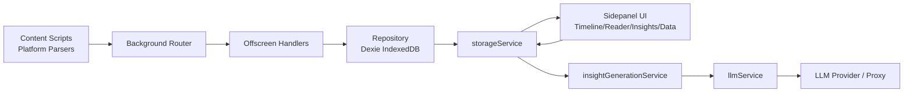
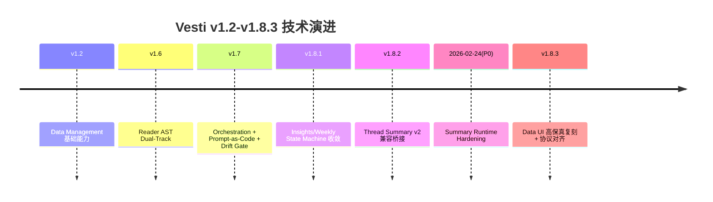
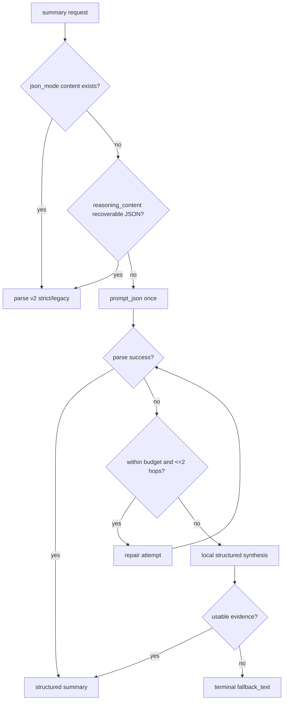

# Vesti 阶段性验收技术说明文档（v1.2-v1.8.3）

- 文档版本：`v1.0`
- 发布日期：`2026-02-25`
- 适用区间：`v1.2 -> v1.8.3`
- 目标受众：具技术背景的市场、生态合作方、技术评审方
- 文档性质：路演技术底稿（公开可分享版）
- 密级：公开可分享（已脱敏）

---

## 1. 封面与版本说明

### 目标
建立统一、可复用、可对外讲述的阶段性技术说明口径，覆盖 v1.2-v1.8.3 的关键工程收敛路径。

### 机制
本文件遵循根目录 `README.md` 的分块叙事方式，但增强为工程闭环结构：`问题证据 -> 根因定位 -> 设计决策 -> 实施改造 -> 验收门禁 -> 可复用模式`。

### 证据
- v1.2-v1.8.3 的架构、规格、交接、事故日志已在 `documents/*` 建立完整链路。
- 本轮实现已完成 `Data` 页协议扩展与 UI 高保真复刻，并通过构建与评测门禁。

### 边界
- 不披露内部绝对路径、密钥、未发布实验参数。
- 不作为工程内部 RFC 的替代文档，不展开逐函数级实现细节。

### 结论
本说明文档可直接作为市场路演素材底稿，且具备技术审查可追溯性。

### Source Anchors
- `README.md`
- `CHANGELOG.md`
- `documents/version_control_plan.md`

---

## 2. 执行摘要（Executive Technical Brief）

### 目标
用最少篇幅回答三个核心问题：为什么项目成立、为什么技术路线可信、为什么本阶段可验收。

### 机制
通过“产品价值主张 + 架构可持续性 + 验收门禁”三段式表达。

### 证据
1. 价值主张成立：Vesti 聚焦 `Local-First` AI 对话记忆中枢，解决多平台对话资产分散、难检索、难复盘的问题。
2. 技术路线可信：Parser/Observer/Storage 分层、Service Isolation、Prompt-as-Code、Schema Drift Gate、Fallback Hierarchy 已形成闭环。
3. 验收依据明确：本阶段关键改造（P0 Summary Runtime Hardening + v1.8.x Insights/Data UI 收敛）均有规格、实现、日志、门禁结果对应。
4. 工程风险可控：采用双重防线（运行时预算+两跳封顶）与结构化降级（非纯文本崩塌），同时保留回滚策略。

### 边界
- 本摘要不覆盖商业化策略与成本模型。
- 不承诺未发布能力（例如 Weekly 解封、跨端同步正式上线）。

### 结论
v1.2-v1.8.3 已从“功能可用”进入“工程可控、可验证、可复用”的阶段性成熟状态，可作为下一阶段路演与生态沟通基础版本。

### Source Anchors
- `README.md`
- `documents/architecture_summary_v1_3.md`
- `documents/engineering_handoffs/2026-02-24-p0-summary-runtime-hardening-handoff.md`
- `documents/engineering_handoffs/2026-02-24-v1_8_1-thread-ai-border-regression-log.md`

---

## 3. 问题定义与设计哲学（Why）

### 目标
将 README 的理念叙事升级为工程语言，明确技术方案背后的约束与取舍。

### 机制
围绕三条原则展开：
1. `Local-First`：数据主权和隐私边界优先。
2. 可解释链路：每个生成结论可追溯到可观测运行路径。
3. 可回滚发布：每个阶段改造可分批发布、独立回退。

### 证据
- 数据在本地 IndexedDB + chrome storage 管理，非依赖中心化后端存储。
- Summary 链路新增可观测字段：`summary_llm_call_count`、`summary_parse_error_codes`、`summary_total_latency_ms` 等。
- 版本治理采用分支与发布 SOP，支持分批提交、分层回滚。

### 边界
- `Local-First` 不等于“永不引入云能力”，而是优先级和默认边界声明。
- 该阶段不涉及数据上云迁移。

### 结论
Vesti 的设计哲学已从产品理念落实为工程约束：默认本地、可观测、可回滚。

### Source Anchors
- `README.md`
- `documents/version_control_plan.md`
- `frontend/src/lib/db/schema.ts`
- `frontend/src/lib/services/insightGenerationService.ts`

---

## 4. 系统边界与运行形态（What the system is now）

### 目标
定义当前系统“是什么/不是什么”，避免对外叙述出现能力漂移。

### 机制
用运行时拓扑 + 模块边界 + 冻结策略三层描述系统现状。

### 证据
- 运行时形态：Browser Extension（Plasmo）+ Sidepanel UI + Offscreen/Background 消息分发。
- 数据层：Dexie（IndexedDB）承担会话、消息、摘要、周报记录。
- 支持平台：ChatGPT / Claude / Gemini / DeepSeek / Qwen / Doubao（捕获与状态能力分阶段增强）。
- Weekly 冻结：Insights 中 `WEEKLY_DIGEST_SOON = true`，保持占位与边界，不宣称解封。

### 边界
- 不提供第三方公网 API。
- 不提供跨设备同步承诺。

### 结论
系统边界清晰：以本地扩展为核心，重点是可控的数据捕获与结构化洞察，不是通用云服务平台。

### Source Anchors
- `documents/architecture_summary_v1_3.md`
- `frontend/src/sidepanel/pages/InsightsPage.tsx`
- `frontend/src/offscreen/index.ts`
- `frontend/src/background/index.ts`

---

## 5. 核心能力矩阵（Capabilities）

### 目标
以统一模板说明核心能力，便于市场与技术团队共用口径。

### 机制
每项能力按 `输入 -> 处理 -> 输出 -> 边界` 描述。

### 证据

#### 5.1 捕获（Capture）
- 输入：平台页面对话 DOM 变化。
- 处理：Observer 监听 + 平台 Parser 解析 + Gate 决策。
- 输出：Conversation/Message 持久化记录。
- 边界：平台 DOM 大幅变更会触发解析脆弱点，需要 selector 策略维护。

#### 5.2 检索（Timeline/Reader）
- 输入：会话索引、搜索词、筛选条件。
- 处理：本地索引查询 + UI 渲染策略（含折叠/展开）。
- 输出：对话列表、详情阅读、关键词检索。
- 边界：当前主要为本地检索，不含跨端联邦检索。

#### 5.3 Thread Summary
- 输入：单会话消息与上下文。
- 处理：Compaction（可跳过）-> 两轮结构化生成 -> 结构化解析/纠偏 -> 降级合成。
- 输出：`conversation_summary.v2` 结构化摘要 + 展示层卡片。
- 边界：极端坏响应下仍可能落终极 `fallback_text`，但已显著收敛。

#### 5.4 Weekly Digest（冻结边界）
- 输入：周范围内对话集合。
- 处理：状态机与阶段机驱动；当前策略保持冻结。
- 输出：`Soon` 占位及既有渲染兼容。
- 边界：不宣称本阶段已解封。

#### 5.5 Data 管理
- 输入：本地存储统计、导出请求、清理动作。
- 处理：`GET_DATA_OVERVIEW` 聚合 + 导出序列化 + 双清理动作分流。
- 输出：Storage/Export/Cleanup/Dashboard(Soon) 统一 Data 页。
- 边界：`Compacted threads` 与 `Last compaction` 当前为 summary proxy 口径。

### 结论
核心能力已从“功能拼接”升级为“可维护能力面板”，并具备统一的边界说明。

### Source Anchors
- `frontend/src/lib/db/repository.ts`
- `frontend/src/sidepanel/containers/ConversationList.tsx`
- `frontend/src/sidepanel/containers/ReaderView.tsx`
- `frontend/src/lib/services/insightGenerationService.ts`
- `frontend/src/sidepanel/components/DataManagementPanel.tsx`

---

## 6. 技术架构分层（How）

### 目标
说明系统如何在不做 schema 迁移的前提下持续演进。

### 机制
分层结构如下：
1. 采集层：Parser / Observer / Gate。
2. 存储层：Dexie schema + Repository API。
3. 协议层：Request/Response 消息契约。
4. 服务层：`storageService`、`insightGenerationService`、`llmService`。
5. 展示层：Timeline/Reader/Insights/Data/Settings。

### 证据
- Prompt-as-Code：提示词版本化与 schema gate 已文档化并在运行时日志中绑定。
- Fallback Hierarchy：`json_mode -> prompt_json -> structured degradation -> terminal fallback_text`。
- State Machine Contract：Insights/Thread/Weekly 均有契约文档与 UI 状态映射。

### 图 1：系统拓扑图（运行时）


### 边界
- 该架构强调内聚边界，不等于微服务化拆分。
- 当前代理修复属于同源联动，但仓内仅保留接口契约与运行时行为。

### 结论
分层架构是本阶段收敛成功的核心前提：问题可定位、改动可隔离、发布可分批。

### Source Anchors
- `documents/architecture_summary_v1_3.md`
- `documents/prompt_engineering/v1_7_prompt_as_code_contract.md`
- `documents/prompt_engineering/v1_7_prompt_schema_drift_gate.md`
- `documents/ui_refactor/v1_8_1_insights_state_machine_contract.md`
- `documents/ui_refactor/v1_8_2_thread_summary_state_machine_contract.md`

---

## 7. 阶段性演进主线（v1.2-v1.8.3）

### 目标
建立阶段演进的一致叙述，便于对外展示“连续改进”而非“点状变更”。

### 机制
按里程碑分段：目标、关键改动、验收证据、遗留风险。

### 证据

#### v1.2（Data Management 奠基）
- 目标：建立可观测存储、可导出、可清理能力。
- 关键改动：存储配额策略、导出格式、清理语义。
- 验收证据：v1.2 工程规格与测试矩阵。
- 遗留风险：指标口径仍需与 compaction lineage 完全对齐。

#### v1.6（Reader Dual-Track）
- 目标：AST 渲染与性能回退双轨。
- 关键改动：`ast_v1` 合同、降级链路、性能兜底。
- 验收证据：reader pipeline 规格与手测。
- 遗留风险：复杂节点覆盖率持续提升空间。

#### v1.7（Orchestration + Prompt-as-Code）
- 目标：多智能体编排与提示词治理。
- 关键改动：事件契约、drift gate、编排发布策略。
- 验收证据：orchestration/prompt 文档包。
- 遗留风险：多模型返回形态漂移需持续监控。

#### v1.8.1（Insights/Weekly 状态机）
- 目标：Insights IA 稳定化与 Weekly 动态状态机。
- 关键改动：状态定义、阶段机、渲染门禁。
- 验收证据：v1.8.1 state machine contract + manual acceptance。
- 遗留风险：UI 微调易与数据路径变更耦合。

#### v1.8.2（Thread Summary skill 对齐）
- 目标：在保持 `conversation_summary.v2` 命名下完成结构升级兼容。
- 关键改动：legacy/new 形态桥接、journey 渲染契约。
- 验收证据：v1.8.2 规格、状态机、手测。
- 遗留风险：旧记录边缘形态仍需 coercion 兜底。

#### P0（2026-02-24，Summary Runtime Hardening）
- 目标：压降 fallback 与时延，修复“同文”退化。
- 关键改动：reasoning_content 回收、两跳封顶、预算控制、结构化降级、代理防御、可观测字段。
- 验收证据：handoff 文档 + 构建评测通过。
- 遗留风险：上游返回形态变化仍需灰度观察。

#### v1.8.3（Data 页高保真复刻 + 接口对齐）
- 目标：Data 页 UI 与能力对齐，避免后端数据缺口。
- 关键改动：新增 `GET_DATA_OVERVIEW`、`CLEAR_INSIGHTS_CACHE`；Data 页重构与 token 化样式。
- 验收证据：两批提交 + build/eval 通过。
- 遗留风险：summary proxy 指标后续需升级为严格 lineage。

### 图 2：版本演进时间轴


### 边界
- 时间线强调主线收敛，不覆盖所有实验分支。

### 结论
v1.2-v1.8.3 并非线性功能迭代，而是架构、运行时、UI、治理四线并行收敛。

### Source Anchors
- `CHANGELOG.md`
- `documents/engineering_data_management_v1_2.md`
- `documents/reader_pipeline/*`
- `documents/orchestration/*`
- `documents/prompt_engineering/*`
- `documents/ui_refactor/v1_8_1_*`
- `documents/ui_refactor/v1_8_2_*`
- `documents/engineering_handoffs/2026-02-24-p0-summary-runtime-hardening-handoff.md`

---

## 8. P0 收敛案例深拆（Summary Runtime Hardening）

### 目标
解决两个 P0 问题：高 fallback 率与异常长时延，并消除“各模块同文”展示退化。

### 机制
1. `reasoning_content` JSON 回收优先于重试。
2. Summary 远端调用两跳封顶 + 45s 时间预算。
3. 短会话 compaction 跳过策略。
4. 解析链路增加 coercion + 错误码。
5. 失败后走结构化降级合成（不是直接纯文本坠落）。
6. 新增可观测字段以支持因果归因。

### 证据
- `llmService` 已实现 `contentSource` 与 reasoning 回收分支。
- `insightGenerationService` 已实现：
  - `SUMMARY_PIPELINE_TIME_BUDGET_MS=45000`
  - `SUMMARY_COMPACTION_SKIP_MAX_MESSAGES=14`
  - `synthesizeDegradedSummaryV2FromRaw(...)`
  - `summary_*` 观测字段落日志
- `insightSchemas` 已实现 `coerceConversationSummaryV2Candidate(...)` 与 parse error codes。
- 评测门禁通过：`pnpm -C frontend eval:prompts --mode=mock --strict`，`gate=PASS`。

### 图 3：Summary 运行时决策流


### 边界
- 即使极端异常输入仍可能触发 terminal fallback_text，但触发路径更窄且可观测。
- 该方案不依赖 DB schema 迁移。

### 结论
P0 修复把“失败即文本坍塌”改造成“可恢复优先、结构化优先、预算可控”的稳定运行时。

### Source Anchors
- `documents/engineering_handoffs/2026-02-24-p0-summary-runtime-hardening-handoff.md`
- `frontend/src/lib/services/llmService.ts`
- `frontend/src/lib/services/insightGenerationService.ts`
- `frontend/src/lib/services/insightSchemas.ts`

---

## 9. 回归事故与工程守则（v1.8.1 AI 卡片边框事件）

### 目标
沉淀一次典型“视觉异常实为数据路径污染”事故，形成可执行工程守则。

### 机制
采用“事故复盘 -> 根因归类 -> 防复发守则”机制。

### 证据
- 事故现象：AI 卡片高度异常（近似仅头部）。
- 根因：边框样式改动与 `thinking_journey` 清洗/兜底逻辑混发，导致内容近空但卡片仍渲染。
- 修正：先回滚到渲染健康基线，再以单职责 UI 改动重引入边框（inset shadow，限定作用域）。

### 可迁移守则（节选）
1. 样式增强与数据路径改动必须分提交。
2. 视觉异常先查输入数据质量，再查布局盒模型。
3. 优先使用布局中性增强原语（如 `inset box-shadow`）。
4. 作用域必须容器化（避免波及生成态与其他模块）。

### 边界
- 该守则适用于前端高频迭代，不替代集成测试。

### 结论
该事件将“局部回归”转化为“流程资产”：单职责提交与基线回滚点成为默认治理策略。

### Source Anchors
- `documents/engineering_handoffs/2026-02-24-v1_8_1-thread-ai-border-regression-log.md`
- `frontend/src/sidepanel/pages/InsightsPage.tsx`
- `frontend/src/style.css`

---

## 10. v1.8.3 Data 页复刻与接口对齐

### 目标
在不迁移 schema 的前提下，实现 Data 页高保真复刻并补齐数据接口缺口，并在本章单列对外接口契约。

### 机制
1. 协议层新增 `GET_DATA_OVERVIEW` 与 `CLEAR_INSIGHTS_CACHE`。
2. 类型层新增 `DataOverviewSnapshot`。
3. 仓储层聚合存储统计与 summary proxy 指标。
4. UI 层重构为分组式 Accordion：Overview / Operations / Roadmap。
5. 样式层新增 `data-*` 专属规则并全量 token 化。

### 证据
- 类型：`DataOverviewSnapshot` 已定义完整字段。
- 协议：request/response 契约已扩展并双路由分发。
- 服务：`getDataOverview()`、`clearInsightsCache()` 已落地并广播 `VESTI_DATA_UPDATED`。
- UI：`DataManagementPanel` 已实现 Storage/Export/Cleanup/Dashboard(Soon)。
- 样式：`style.css` 新增 `data-*` 规则，含状态 pill、danger zone、soon badge、accordion 动画等。

#### Public APIs / Interfaces / Types（单列）

##### 外部 API
- 本阶段未引入面向第三方公网 API。

##### 内部消息协议新增
1. `GET_DATA_OVERVIEW`
   - 请求：无 payload
   - 响应：`DataOverviewSnapshot`
2. `CLEAR_INSIGHTS_CACHE`
   - 请求：无 payload
   - 响应：`{ cleared: boolean }`

##### 类型新增
`DataOverviewSnapshot`：
- `storage: StorageUsageSnapshot`
- `totalConversations: number`
- `compactedThreads: number`
- `summaryRecordCount: number`
- `weeklyReportCount: number`
- `lastCompactionAt: number | null`
- `indexedDbName: string`

##### 实现映射
- 协议层：`frontend/src/lib/messaging/protocol.ts`
- 服务层：`frontend/src/lib/services/storageService.ts`
- 仓储层：`frontend/src/lib/db/repository.ts`
- 路由分发：`frontend/src/offscreen/index.ts`、`frontend/src/background/index.ts`

##### 兼容结论
- 不做 DB schema migration。
- 不变更外部调用签名。
- Weekly 冻结策略保持不变。

### 边界
- `compactedThreads`、`lastCompactionAt` 现为 summary cache proxy，不代表严格 Agent A lineage。
- Dashboard 保持 `Soon` 占位。

### 结论
v1.8.3 通过“接口先对齐、UI 后复刻”的顺序，避免了前后端语义错位，并保持迁移成本最低。

### Source Anchors
- `frontend/src/lib/types/index.ts`
- `frontend/src/lib/messaging/protocol.ts`
- `frontend/src/lib/services/storageService.ts`
- `frontend/src/lib/db/repository.ts`
- `frontend/src/offscreen/index.ts`
- `frontend/src/background/index.ts`
- `frontend/src/sidepanel/components/DataManagementPanel.tsx`
- `frontend/src/sidepanel/pages/DataPage.tsx`
- `frontend/src/style.css`
- 提交证据：`50244db`、`effd51c`

---

## 11. 质量门禁与发布治理

### 目标
说明“如何证明可发布”，并给出可执行回滚路径。

### 机制
采用四层门禁：静态构建 -> Prompt 评测 -> 手测采样 -> 分批发布。

### 证据
1. 构建门禁：`pnpm -C frontend build` 通过。
2. Prompt 评测门禁：`pnpm -C frontend eval:prompts --mode=mock --strict` 通过，`gate=PASS`。
3. 评测快照（示例）：`format=100`、`coverage=100`、`weeklyComplete=100`、`weeklyEvidence=100`。
4. 分批发布：
   - 批次一（协议/仓储）：`50244db`
   - 批次二（UI/CSS）：`effd51c`
5. 回滚策略：按提交边界回滚，不跨层混回。

### 监控指标（运行时）
- `summary_fallback_rate`
- `summary_consecutive_fallback_count`
- `summary_p95_latency_ms`
- `summary_llm_call_count`
- `summary_json_recovered_from_reasoning`
- `summary_local_synthesis_used`
- `summary_parse_error_codes`

### 边界
- 当前门禁以 mock/本地评测为主，线上分布仍需发布后观察窗口验证。

### 结论
发布治理已从“单次构建成功”升级为“可观测、可回滚、可归因”的工程闭环。

### Source Anchors
- `frontend/package.json`
- `documents/version_control_plan.md`
- `documents/engineering_handoffs/2026-02-24-p0-summary-runtime-hardening-handoff.md`
- `CHANGELOG.md`

---

## 12. 风险清单与后续路线图

### 目标
给出可执行的短中期风险管理与优先级建议。

### 机制
按 `风险 -> 影响 -> 缓释动作 -> 优先级` 输出。

### 证据

| 风险 | 影响 | 缓释动作 | 优先级 |
|---|---|---|---|
| 上游模型返回形态持续漂移 | 结构化成功率波动 | 保持 reasoning salvage + coercion 规则迭代 + parse code 监控 | P0 |
| Summary proxy 指标语义偏差 | Data 页指标解释争议 | 增加口径注释，后续升级 strict lineage 统计 | P1 |
| UI 微调与数据逻辑混发 | 回归定位困难 | 单职责提交、强制回滚点、样式变更隔离清单 | P0 |
| Weekly 冻结期间的预期落差 | 外部沟通误差 | 明确 `Soon` 边界，不宣称未上线能力 | P1 |
| 多平台 parser 脆弱性 | 捕获稳定性下降 | selector 观测、平台专项手测、发布前采样矩阵 | P1 |

### 后续优先级（建议）
1. P0：持续压降 summary fallback 与尾延迟，完善 parse drift 监控看板。
2. P1：把 Data 页 summary proxy 指标升级为 strict compaction lineage。
3. P1：扩展 Data dashboard 从占位到只读趋势视图（不引入新写路径）。
4. P2：在保持 Local-First 前提下，探索可选加密同步方案。

### 边界
- 路线图仅覆盖工程可行性优先级，不含资源预算与商业排期。

### 结论
后续路线已从“功能愿景”落在“可执行风险治理”层，具备持续迭代基础。

### Source Anchors
- `README.md`
- `CHANGELOG.md`
- `documents/architecture_summary_v1_3.md`
- `documents/engineering_handoffs/2026-02-24-p0-summary-runtime-hardening-handoff.md`
- `documents/engineering_handoffs/2026-02-24-v1_8_1-thread-ai-border-regression-log.md`

---

## 13. 附录

### 目标
提供统一术语、文件映射、引用清单与命令模板，保证该文档可复用、可追溯、可执行。

### 机制
附录拆分为术语、文件索引、引用文档、命令清单、工程模式五个子集。

### 证据

#### 附录 A：术语表
- `Local-First`：本地存储和本地控制为默认边界。
- `Prompt-as-Code`：提示词版本化、可追踪、可测试、可回滚。
- `Schema Drift Gate`：结构化输出与 schema 契约的漂移门禁。
- `Fallback Hierarchy`：分层兜底策略，避免直接坠落到低质量输出。
- `Structured Degradation`：降级时保持结构化语义可渲染。
- `State Machine Contract`：UI 状态定义、映射规则与渲染保证契约。

#### 附录 B：文件索引（核心）
- 协议/类型
  - `frontend/src/lib/messaging/protocol.ts`
  - `frontend/src/lib/types/index.ts`
- 服务/运行时
  - `frontend/src/lib/services/storageService.ts`
  - `frontend/src/lib/services/llmService.ts`
  - `frontend/src/lib/services/insightGenerationService.ts`
  - `frontend/src/lib/services/insightSchemas.ts`
- 仓储/分发
  - `frontend/src/lib/db/repository.ts`
  - `frontend/src/offscreen/index.ts`
  - `frontend/src/background/index.ts`
- UI
  - `frontend/src/sidepanel/pages/DataPage.tsx`
  - `frontend/src/sidepanel/components/DataManagementPanel.tsx`
  - `frontend/src/sidepanel/pages/InsightsPage.tsx`
  - `frontend/src/style.css`

#### 附录 C：引用文档清单
- `documents/engineering_data_management_v1_2.md`
- `documents/architecture_summary_v1_3.md`
- `documents/reader_pipeline/v1_6_data_pipeline_dual_track_spec.md`
- `documents/orchestration/v1_7_multi_agent_orchestration_spec.md`
- `documents/prompt_engineering/v1_7_prompt_as_code_contract.md`
- `documents/prompt_engineering/v1_7_prompt_schema_drift_gate.md`
- `documents/ui_refactor/v1_8_1_insights_state_machine_contract.md`
- `documents/ui_refactor/v1_8_2_thread_summary_state_machine_contract.md`
- `documents/engineering_handoffs/2026-02-24-p0-summary-runtime-hardening-handoff.md`
- `documents/engineering_handoffs/2026-02-24-v1_8_1-thread-ai-border-regression-log.md`
- `documents/version_control_plan.md`
- `CHANGELOG.md`

#### 附录 D：关键命令清单

```bash
# 构建门禁
pnpm -C frontend build

# Prompt 评测门禁
pnpm -C frontend eval:prompts --mode=mock --strict

# 查看最近提交（发布切片核对）
git log --oneline -n 8
```

#### 附录 E：可复用工程模式（>=8）
1. Reasoning-channel salvage before retry
2. Strict schema + bounded coercion
3. Two-hop cap + wall-clock budget
4. Structured degradation over plain-text collapse
5. Single-purpose fallback hierarchy
6. Telemetry as runtime contract
7. Split rollout for causality attribution
8. UI anomaly first checks data-path integrity
9. Single-responsibility commits for UI micro-changes
10. Scoped selectors to prevent cross-module style bleed

### 边界
- 附录提供可复用模板，不替代详细实现文档。

### 结论
附录使该文档具备可审计性与二次传播能力，支持市场与工程协同复用。

### Source Anchors
- `README.md`
- `CHANGELOG.md`
- `documents/*`
- `frontend/src/*`

---

> 本文档为公开可分享版，强调工程逻辑可验证与对外叙述可复用。内部排障细节已抽象为可迁移方法论，不暴露敏感上下文。
