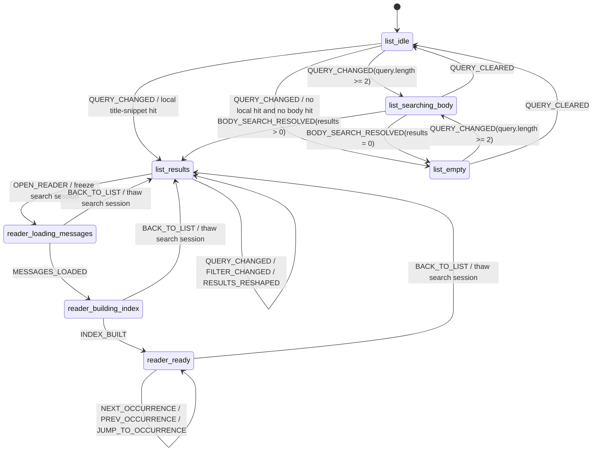

# Threads Search State Machine Contract

Version: topic-based canonical contract  
Phase: threads-search-and-reader-navigation  
Status: Decision Complete (State and data contract only)  
Audience: Frontend engineers, QA, release owners

---

## 1. Summary

This document defines the state topology and data contract for Threads search and Reader navigation.

It is the companion contract to:
- `threads_search_engineering_spec.md`

The state machine is intentionally explicit about three things:
1. when search state is frozen and thawed
2. when Reader has messages but is still building a local occurrence index
3. which data belongs to offscreen versus which data is derived locally in the frontend

---

## 2. State Topology



---

## 3. Data Contract

### 3.1 Offscreen query contract

```ts
export interface SearchConversationMatchesQuery {
  query: string;
  conversationIds?: number[];
}

export interface ConversationMatchSummary {
  conversationId: number;
  firstMatchedMessageId: number;
  bestExcerpt: string;
}
```

Rules:
- repository, `storageService`, and messaging/offscreen handler all keep the same query and response shape.
- message type for this contract is `SEARCH_CONVERSATION_MATCHES_BY_TEXT`.
- `firstMatchedMessageId` is the earliest matched message by `created_at`; ties fall back to lower message id.
- `bestExcerpt` must be cut from the same message identified by `firstMatchedMessageId`.
- `conversationIds` limits the scan to the current list candidate set when provided.
- offscreen never returns occurrence-level detail.

### 3.2 Search session contract

```ts
export interface SearchSession {
  query: string;
  normalizedQuery: string;
  datePreset: DatePreset;
  selectedPlatforms: Platform[];
  resultSummaryMap: Record<number, ConversationMatchSummary>;
  anchorConversationId: number | null;
  scrollTop?: number | null; // fallback only; do not rely on for dynamic-height cards
}

export type FrozenSearchSession = Readonly<SearchSession>;
```

Rules:
- `resultSummaryMap` is keyed only by `conversationId`.
- `anchorConversationId` is the authoritative restore anchor for returning to the list.
- `scrollTop` is optional and non-authoritative.

### 3.3 Reader occurrence contract

```ts
export interface ReaderOccurrence {
  occurrenceKey: string;
  messageId: number;
  nodeKey: string;
  charOffset: number;
  length: number;
}

export interface ReaderSearchModel {
  query: string;
  firstMatchedMessageId: number | null;
  occurrences: ReaderOccurrence[];
  currentIndex: number;
}
```

Rules:
- `ReaderOccurrence` is derived locally from loaded messages.
- `nodeKey` must be stable between index building and render targeting.
- `nodeKey` should use an AST/renderer path string, not a random uuid.
- recommended form: `msg-42:p[1]:text[0]`

### 3.4 Threads state union

```ts
type ListIdleState = {
  mode: "list_idle";
  session: SearchSession;
};

type ListSearchingBodyState = {
  mode: "list_searching_body";
  session: SearchSession;
};

type ListResultsState = {
  mode: "list_results";
  session: SearchSession;
};

type ListEmptyState = {
  mode: "list_empty";
  session: SearchSession;
};

type ReaderLoadingMessagesState = {
  mode: "reader_loading_messages";
  session: FrozenSearchSession;
  conversationId: number;
  firstMatchedMessageId: number | null;
};

type ReaderBuildingIndexState = {
  mode: "reader_building_index";
  session: FrozenSearchSession;
  conversationId: number;
  firstMatchedMessageId: number | null;
  messages: Message[];
};

type ReaderReadyState = {
  mode: "reader_ready";
  session: FrozenSearchSession;
  conversationId: number;
  firstMatchedMessageId: number | null;
  messages: Message[];
  searchModel: ReaderSearchModel;
};

export type ThreadsState =
  | ListIdleState
  | ListSearchingBodyState
  | ListResultsState
  | ListEmptyState
  | ReaderLoadingMessagesState
  | ReaderBuildingIndexState
  | ReaderReadyState;
```

---

## 4. Event Semantics

Primary events:

```ts
type ThreadsEvent =
  | { type: "QUERY_CHANGED"; query: string }
  | { type: "FILTER_CHANGED"; datePreset: DatePreset; selectedPlatforms: Platform[] }
  | { type: "BODY_SEARCH_STARTED" }
  | { type: "BODY_SEARCH_RESOLVED"; summaries: ConversationMatchSummary[] }
  | { type: "QUERY_CLEARED" }
  | { type: "OPEN_READER"; conversationId: number; firstMatchedMessageId: number | null }
  | { type: "MESSAGES_LOADED"; messages: Message[] }
  | { type: "INDEX_BUILT"; searchModel: ReaderSearchModel }
  | { type: "NEXT_OCCURRENCE" }
  | { type: "PREV_OCCURRENCE" }
  | { type: "JUMP_TO_OCCURRENCE"; index: number }
  | { type: "BACK_TO_LIST" };
```

Rules:
- `OPEN_READER` freezes the current `SearchSession`.
- `BACK_TO_LIST` restores the same session as mutable list state.
- `MESSAGES_LOADED` does not imply navigation readiness.
- only `INDEX_BUILT` may enter `reader_ready`.

---

## 5. Invariants

1. In all `reader_*` modes, `SearchSession` is read-only.
2. Reader navigation never mutates `resultSummaryMap`.
3. `firstMatchedMessageId` and `bestExcerpt` remain semantically aligned.
4. Occurrence indexing is local to the loaded Reader conversation.
5. List restore is anchored by `anchorConversationId`, not `scrollTop`.
6. If the user exits during `reader_building_index`, the state machine must return cleanly to `list_results`.

---

## 6. Rendering Bridge Requirements

The renderer layer must be able to map `ReaderOccurrence.nodeKey` back to a rendered text target.

Required behavior:
- `AstMessageRenderer` and `MessageBubble` must preserve stable path-based node keys during render
- the same key must be usable for:
  - building `occurrences[]`
  - injecting `<mark>` segments
  - locating the active occurrence for `scrollIntoView` and focus

This bridge is the reason `nodeKey` is a first-class field in the state contract rather than an implementation footnote.

---

## 7. Non-goals

1. Encoding offscreen occurrence offsets into storage or messaging payloads.
2. Re-sorting Threads list by relevance.
3. Making `scrollTop` a required restore primitive.
4. Treating Reader loading and index building as the same state.
